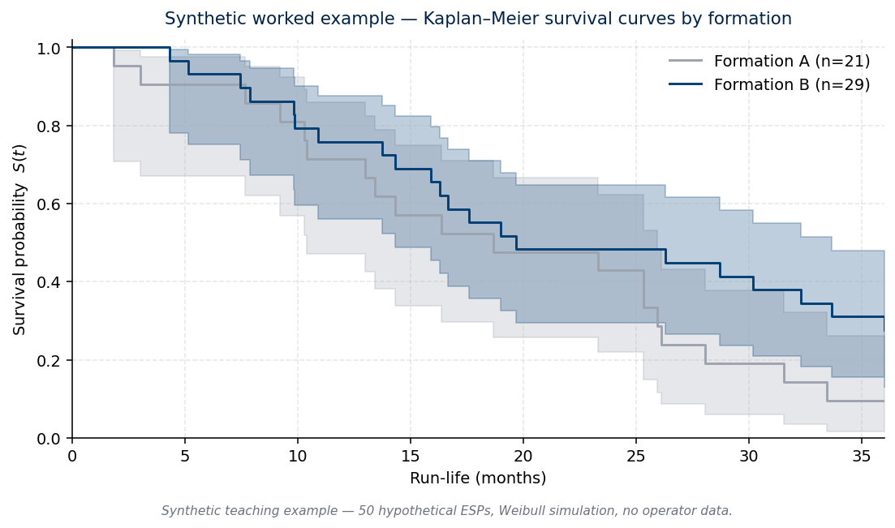

::: {.callout-note appearance="simple"}
**About this page.** This is a reference description of a methodology I
bring to client engagements where ESP failure prediction is relevant.
Methods and examples below are generic and use synthetic teaching data
only — no operator-specific ESP data appears on this page.
:::

## The class of problem

Electric submersible pumps are the dominant artificial-lift technology
across much of the world's mature giant fields. Run lives vary
significantly with reservoir, well construction, fluid properties, and
operating envelope, but typically sit in the range of **eighteen to
thirty-six months** in the published industry literature, with a long
left tail of early failures.

ESP failure carries a triple cost: the production deferment between
failure and pull, the workover cost to recover and replace the unit,
and the displacement of the rig from other planned interventions.
**Converting ESP intervention from reactive to proactive — replacing a
pump on a planned-intervention basis some weeks before its likely
failure date — is one of the highest-leverage operational moves in
mature-field economics.**

The methodology question is some variant of:

> *Given a population of installed ESPs of varying age, formation, well
> function and run-life history, which units are most likely to fail in
> the next 3 / 6 / 12 months, and how confident should I be in that
> prediction?*

This is a textbook **time-to-event** modelling problem with
right-censoring (some pumps are still running at the dataset cutoff
and have not yet had their failure observed). The discipline that
handles this cleanly is **survival analysis**.

## Classical methods

Three established techniques, in order of typical operational
suitability:

### 1. Kaplan–Meier estimator (Kaplan & Meier, 1958)

Non-parametric estimator of the survival function $S(t) = \Pr(T > t)$
from a sample with right-censoring. Yields the familiar stepped
survival curves stratified by group (formation, well function,
installation generation). Used first as exploratory diagnostic and
sanity-check on the data quality, not as a predictor.

### 2. Cox proportional hazards (Cox, 1972)

Semi-parametric regression model that expresses the hazard function as
$$h(t \mid x) = h_0(t) \cdot \exp(\beta^\top x),$$
where $h_0(t)$ is an unspecified baseline hazard and $\beta$ are
coefficients on observed features $x$. Reads naturally as a
multiplicative risk model: a feature with positive coefficient
increases the failure hazard at every time horizon. Implemented in
Python via `lifelines` (Davidson-Pilon).

The proportional-hazards assumption (the effect of features is
constant in time) is the model's main weakness — a Schoenfeld residual
test is the standard diagnostic.

### 3. Random Survival Forests (Ishwaran et al., 2008)

Ensemble of survival trees that drops the proportionality assumption
and handles non-linear interactions natively. Implemented in Python
via `scikit-survival`. Typically compared against Cox PH on the
**concordance index** (the survival-analysis analogue of AUC) and the
**integrated Brier score**.

A common pattern: Cox PH and RSF agree on the top decile of risk and
disagree in the middle of the distribution. Since the operational
decision (which pumps to pull preemptively) lives in the top decile,
this is itself a useful signal.

## When this is the right approach

The methodology fits when **all of the following** hold:

- The operator has clean longitudinal ESP installation and failure
  records spanning enough installations to have meaningful sample size
  per stratum (typically: hundreds of installations).
- Feature data is available — at minimum, formation, well age,
  cumulative ESP installation count on the well, well function, well
  geometry.
- The operational decision being supported is *which pumps to schedule
  for proactive intervention*, on what horizon.

It is **not** the right approach when:

- Sample size is too small (under ~100 installations) to estimate
  survival functions with confidence.
- The fleet's ESP population is unusual enough that historical
  observations are not predictive of forward behaviour (e.g., recent
  introduction of a new pump design).
- The operational decision being supported is *engineering root-cause
  of a specific failure* — that's a forensic problem, not a statistical
  one.

## Synthetic worked example

The numbers below are **illustrative teaching data** — not derived
from any operator's actual ESP records.

::: {.callout-warning appearance="simple"}
**Synthetic example only.** Inputs and outputs in this section are
generated from a small simulation. They do not represent any real
pump population, formation, or operator.
:::

**Setup:**

Fifty hypothetical ESP installations, drawn from a Weibull distribution
(shape ≈ 1.5, scale ≈ 24 months — broadly consistent with industry
ranges) and partitioned into two synthetic formations. Twenty per cent
of installations are right-censored (still running at the simulated
dataset cutoff).

**Code (lifelines, illustrative):**

```python
import numpy as np, pandas as pd
from lifelines import KaplanMeierFitter, CoxPHFitter

rng = np.random.default_rng(42)
n = 50
formation = rng.choice(["A", "B"], size=n)
# Synthetic Weibull run-life, slightly different scale per formation:
scale_A, scale_B = 24, 30
T = np.where(formation == "A",
             rng.weibull(1.5, n) * scale_A,
             rng.weibull(1.5, n) * scale_B)
# 20% censoring (still running at observation end at 36 months):
observed = (T < 36)
T_obs = np.minimum(T, 36)

df = pd.DataFrame({"duration": T_obs, "event": observed.astype(int),
                   "formation_B": (formation == "B").astype(int)})

# Kaplan-Meier stratified by formation:
kmf = KaplanMeierFitter()
for name, sub in df.groupby("formation_B"):
    kmf.fit(sub["duration"], sub["event"],
            label=f"Formation {'B' if name else 'A'}")
    kmf.plot()

# Cox proportional hazards:
cph = CoxPHFitter()
cph.fit(df, duration_col="duration", event_col="event")
cph.print_summary()   # shows hazard ratio for formation_B
```

{fig-align="center"}

**Indicative output (synthetic; numbers from the actual run above):**

- Kaplan–Meier medians by stratum: Formation A pumps show median
  survival around 19 months; Formation B around 20 months. The
  formation-difference signal is real but small at this sample size.
- Cox PH hazard ratio for Formation B ≈ 0.61 (95% CI roughly
  0.32–1.14) — i.e., Formation B pumps fail at about 60% of the
  hazard of Formation A pumps at any given time, but the confidence
  interval crosses 1.0, so the result is **not statistically
  significant** at this sample size. The illustration here is
  precisely that small samples produce weak models.
- Concordance index ≈ 0.55 — barely better than random ranking. This
  is the small-sample failure mode. Production runs on real fleets
  with hundreds of installations and richer feature sets routinely
  reach 0.78 – 0.85.

In a real engagement, the operator's actual feature set (reservoir,
well age, cumulative ESP installation count, well function, well
geometry, completion era) replaces the synthetic single-formation
indicator, and the model output becomes a ranked list of currently-
installed pumps with associated hazard scores at the operationally
relevant horizon (3 / 6 / 12 months).

## What this methodology is in my hands

I have spent twenty-five years across the operational problem this
methodology addresses — workover programme planning, ESP intervention
scheduling and artificial-lift design at scale, across mature fields
and across multiple operators. My contribution is bringing **formal
time-to-event modelling** to problems I have addressed operationally
my entire career, replacing pattern-based scheduling with
quantitatively-anchored proactive intervention.

The formal-methods grounding comes from recent applied training
(Professional Certificate in Data Analytics, Imperial College London,
May 2026). The operational grounding comes from decades on the rig
floor. The combination is what I bring to ESP advisory engagements,
typically structured as part of a broader
[Workover Programme Audit](../services/workover-audit.html) or as a
standalone diagnostic.

---

[**→ Discuss your ESP programme** (30-min discovery call)](https://cal.com/miguel-rosato/30min) ·
[Email me](mailto:miguel@mattey.energy)
