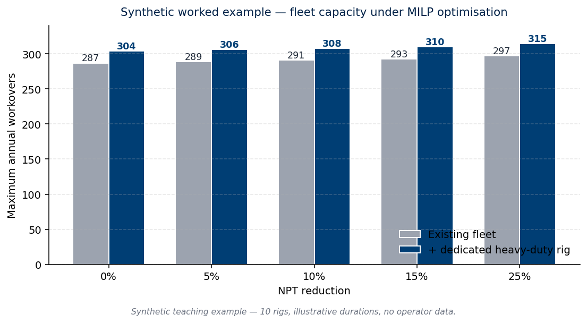

::: {.callout-note appearance="simple"}
**About this page.** This is a reference description of a methodology I
bring to client engagements through the
[Workover Programme Audit](../services/workover-audit.html) service.
Methods and examples below are generic and use synthetic teaching data
only — no operator-specific data appears on this page.
:::

## The class of problem

A workover-fleet operator with a finite number of rigs faces an annual
demand for interventions split across operational categories of varying
duration and value. Each rig has finite capacity (rig-days per year),
each intervention category has a different mean duration and a different
non-productive-time (NPT) profile, and operational constraints set floors
under certain categories (well integrity, ESP-replacement cadence) that
cannot be allowed to drop.

The recurring management question is some variant of:

> *Given my current fleet and current NPT levels, what is the maximum
> annual throughput I can sustain, what mix should it deliver, and how
> much additional throughput would a structural change to the fleet
> deliver?*

This is a textbook **capacitated allocation problem**, well-suited to
integer linear programming. The formulation has been applied to
upstream wells operations in the published literature since the early
2000s, and remains an active area in the SPE/OnePetro corpus.

## Classical formulation

For category $c \in \{\text{BASIC}, \text{ENHANCED}, \text{COMPLEX}\}$
(any other category set works identically):

**Decision variables.** Integer counts of workovers to deliver in the
next planning horizon:
$$n_c \in \mathbb{Z}_{\geq 0}.$$

**Objective.** Maximise total annual workover count:
$$\max \; \sum_c n_c.$$

**Constraints.**

- **Fleet capacity**, with NPT decomposed into a fixed productive
  component $p_c$ and a compressible NPT component $t_c$, and a global
  NPT-reduction factor $r \in [0, 1]$:
  $$\sum_{c} n_c \cdot \left( p_c + t_c \cdot (1 - r) \right) \leq N_{\text{rigs}} \times 365.$$
- **Category floors** (operational realities such as ESP cadence and
  well-integrity workover minima):
  $$n_c \geq C_{\min, c}.$$
- **Non-negativity and integrality** (implicit in the decision-variable
  definition).

The decomposition of duration into a productive component $p_c$ (which
cannot be compressed) and a reducible NPT component $t_c$ (which can)
is the analytical move that lets the formulation express *NPT reduction*
as a free variable separately from *category-mix rebalancing*. Both
levers can then be evaluated on the same footing.

Solved via PuLP with the CBC solver in Python; typical wallclock for a
problem this size is under 50 ms on a 2024 laptop. No proprietary
solver is required.

## When this is the right approach

The methodology fits when **all of the following** hold:

- The operator has a finite, identifiable fleet with reasonably stable
  rig-day capacity.
- Intervention demand is bucketable into a small number of categories
  with stable mean duration and NPT profile per category.
- Operational floors (ESP cadence, integrity, regulatory minimums) are
  knowable and writable as linear constraints.
- The management question is a *programme-level allocation* decision,
  not a per-well sequencing decision.

It is **not** the right approach when:

- Per-well dependencies (zone access, equipment availability, crew
  rotation) dominate the calendar — in which case a scheduling
  formulation (e.g., a constraint-programming or RCPSP model) is more
  appropriate.
- The fleet is being expanded or contracted mid-year — in which case
  the model needs to become time-indexed.
- The operator is exploring entirely new intervention types whose
  duration and NPT profile are not yet characterised.

## Synthetic worked example

The numbers below are **illustrative teaching data** — not derived from
any operator's actual workover programme.

::: {.callout-warning appearance="simple"}
**Synthetic example only.** Inputs and outputs in this section are
constructed to demonstrate the methodology. They do not represent any
real fleet, well, or operator.
:::

**Setup:**

| Parameter | Value |
|---|---:|
| Fleet size | 10 rigs |
| Annual rig-days | 3,650 |
| BASIC mean duration | 10 days (1 day NPT, 9 days productive) |
| ENHANCED mean duration | 16 days (2 days NPT, 14 days productive) |
| COMPLEX mean duration | 22 days (3 days NPT, 19 days productive) |
| Minimum ENHANCED / year | 100 |
| Minimum COMPLEX / year | 15 |

**Code (PuLP, runs in under 50 ms):**

```python
from pulp import LpProblem, LpMaximize, LpVariable, LpInteger, value

N_RIGS, MIN_E, MIN_C = 10, 100, 15
CAP = N_RIGS * 365

# Productive + NPT for each category
p_B, t_B = 9, 1     # BASIC:    10 d
p_E, t_E = 14, 2    # ENHANCED: 16 d
p_C, t_C = 19, 3    # COMPLEX:  22 d

def solve(r_pct, min_complex):
    factor = 1 - r_pct / 100
    d_B = p_B + t_B * factor
    d_E = p_E + t_E * factor
    d_C = p_C + t_C * factor
    m = LpProblem("WO_MILP", LpMaximize)
    nB = LpVariable("nB", lowBound=0, cat=LpInteger)
    nE = LpVariable("nE", lowBound=0, cat=LpInteger)
    nC = LpVariable("nC", lowBound=0, cat=LpInteger)
    m += nB + nE + nC
    m += nE >= MIN_E
    m += nC >= min_complex
    m += nB * d_B + nE * d_E + nC * d_C <= CAP
    m.solve()
    return int(value(nB)), int(value(nE)), int(value(nC))

# Solve five NPT scenarios under two fleet configurations:
for r in [0, 5, 10, 15, 25]:
    fleet = solve(r, MIN_C)              # existing fleet
    ded   = solve(r, MIN_C // 2)         # half COMPLEX offloaded
```

**Output (synthetic):**

| NPT reduction | Existing fleet max total | + dedicated rig (fleet + 8 ded) | Δ |
|---|---:|---:|---:|
| 0% (baseline) | 287 | 296 + 8 = 304 | +17 |
| −5% | 289 | 298 + 8 = 306 | +17 |
| −10% | 291 | 300 + 8 = 308 | +17 |
| −15% | 293 | 302 + 8 = 310 | +17 |
| −25% | 297 | 307 + 8 = 315 | +18 |

{fig-align="center"}

The pattern visible above is the methodologically interesting one. Under
the synthetic example, **NPT reduction alone adds ~10 workovers across
the full reduction range** (287 → 297), while **offloading half the
COMPLEX workovers to a dedicated rig adds ~17 workovers regardless of
NPT level**. This is structural: COMPLEX jobs consume the most
rig-days per intervention, so removing them creates more fleet headroom
than compressing NPT across all categories.

In a real engagement, the operator's actual category mix and durations
replace the synthetic numbers, the floors are set from the operator's
own operational policies, and the recommendation falls out of the
solve.

## What this methodology is in my hands

I have spent twenty-five years across the operational problem this
methodology addresses — workover programme planning at scale, across
mature fields and across multiple operators (Eni, Total, Maersk Oil,
BP, Petronas Carigali, Reliance Industries). My contribution is
bringing **formal optimisation methods** to problems I have addressed
operationally my entire career, sharpening engineering judgment that
would otherwise be expressed in spreadsheets and meeting-room debate.

The formal-methods grounding comes from recent applied training
(Professional Certificate in Data Analytics, Imperial College London,
May 2026). The operational grounding comes from decades on the rig
floor. The combination is what I bring to the
[Workover Programme Audit](../services/workover-audit.html) service.

---

[**→ Discuss your workover programme** (30-min discovery call)](https://cal.com/miguel-rosato/30min) ·
[Email me](mailto:miguel@mattey.energy)
